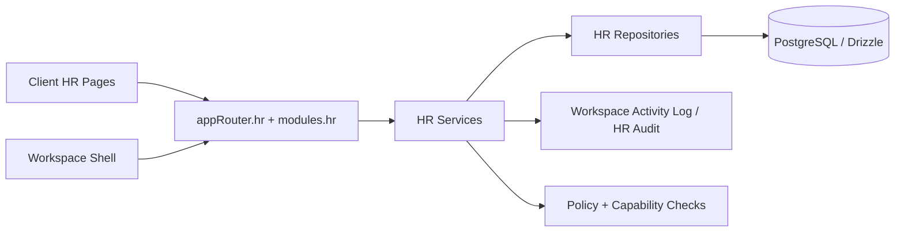

# HR Module Phase 1 PR Plan

## Document Status

- **Document type:** PR-ready execution plan
- **Target repo path:** `docs/hr/HR_MODULE_PHASE1_PR_PLAN.md`
- **Target app:** `MyNewAp1Claude`
- **Module key:** `hr`
- **Scope:** Phase 1 implementation only
- **Phase 1 theme:** Workforce backbone + native module registration

---

## 1. Purpose

This document converts the HR strategy and repo scaffold into a **concrete first implementation wave**.

It is designed to answer:

- what should be implemented first
- how to split the work into safe pull requests
- which files should be created or updated
- which database tables are required for the first useful HR release
- which backend and frontend surfaces should exist in Phase 1
- how HR becomes both a **standalone module** and a **workspace-consumable workforce service**

This is the first buildable slice, not the full final HR suite.

---

## 2. Phase 1 Outcome

At the end of Phase 1, the app should support the following:

1. HR is registered as a **native workspace module**.
2. HR has a global module surface with its own routes, pages, and tRPC router.
3. The database contains the first workforce backbone tables.
4. Users can browse an **employee directory**.
5. Users can browse **org units** and **positions**.
6. HR and workspace admins can assign workers to workspaces.
7. Workspaces can query HR for eligible workers and assigned staff.
8. Sensitive fields are not exposed through directory endpoints.
9. All write operations are auditable.
10. The implementation is structured to expand cleanly into recruitment, onboarding, time, learning, performance, compensation, compliance, and analytics later.

---

## 3. Phase 1 Scope Boundaries

## In scope

- native module registration
- HR root router and module router
- employee directory backbone
- organization backbone
- position management backbone
- workspace staffing assignments
- basic skill and certification lookup support
- first audit and policy hooks
- first frontend shell and backbone pages
- first workspace-facing HR queries
- first migrations
- first tests

## Out of scope

These should **not** be built in Phase 1:

- candidate ATS workflows
- onboarding checklists
- offboarding workflows
- leave balances
- time tracking
- compensation records
- benefits enrollment
- grievances or investigations
- performance cycles
- succession planning
- advanced analytics and dashboards
- payroll integration
- external HRIS sync connectors

---

## 4. Phase 1 Product Surface

The Phase 1 UI should include these pages:

### Global HR pages

- `/hr`
- `/hr/directory`
- `/hr/organization`
- `/hr/positions`
- `/hr/staffing`
- `/hr/skills`
- `/hr/reports` (minimal placeholder)
- `/hr/settings` (minimal placeholder)

### Workspace-consumable pages

These can live inside the existing workspace execution shell later in the phase:

- `/w/:workspaceId/hr/staff`
- `/w/:workspaceId/hr/assignments`
- `/w/:workspaceId/hr/find-workers`

### Minimum first-use journeys

1. Open HR module from main navigation.
2. Search employees by name, title, org unit, skill, or workspace assignment.
3. Open an employee detail drawer or page.
4. View worker summary, org placement, position, and current workspace assignments.
5. Open staffing page for a workspace.
6. Search eligible workers.
7. Assign a worker to the workspace.
8. End or update a workspace assignment.

---

## 5. Architecture Slice for Phase 1



### Phase 1 domain slices

- `directory`
- `organization`
- `staffing`
- `shared`
- `security` (minimal)
- `analytics` (minimal read model or placeholder)

---

## 6. Phase 1 Canonical Data Model

The first release should use these tables as the backbone.

## 6.1 Required tables

### Core identity and workforce

- `hr_people`
- `hr_worker_profiles`
- `hr_employment_records`

### Organization and roles

- `hr_org_units`
- `hr_positions`
- `hr_job_families`
- `hr_job_levels`

### Staffing and assignment

- `hr_workspace_assignments`
- `hr_worker_skills`
- `hr_worker_certifications`

### Documents and audit metadata

- `hr_documents` (metadata only in Phase 1)
- `hr_audit_log` or reuse workspace activity log plus HR-specific audit table

## 6.2 Required concepts

### Person
The human identity.

### Worker profile
The workforce identity used by the platform.

### Employment record
The effective-dated employment relationship.

### Org unit
Department, division, business unit, or team.

### Position
Approved seat in the org.

### Workspace assignment
How a worker participates in a workspace.

---

## 7. Recommended Table Design for Phase 1

## 7.1 `drizzle/tables/hr-core.ts`

Should contain:

- `hrPeople`
- `hrWorkerProfiles`
- `hrEmploymentRecords`

### `hrPeople`

Suggested columns:

- `id`
- `tenantId`
- `externalRef`
- `firstName`
- `lastName`
- `displayName`
- `preferredName`
- `primaryEmail`
- `primaryPhone`
- `status`
- `createdAt`
- `updatedAt`

### `hrWorkerProfiles`

Suggested columns:

- `id`
- `personId`
- `employeeNumber`
- `workerType`
- `managerWorkerId`
- `homeOrgUnitId`
- `primaryPositionId`
- `employmentCategory`
- `homeWorkspaceVisibility`
- `status`
- `createdAt`
- `updatedAt`

### `hrEmploymentRecords`

Suggested columns:

- `id`
- `workerId`
- `employmentStatus`
- `contractType`
- `startDate`
- `endDate`
- `probationEndDate`
- `legalEntity`
- `workLocation`
- `costCenter`
- `effectiveFrom`
- `effectiveTo`
- `createdAt`
- `updatedAt`

---

## 7.2 `drizzle/tables/hr-organization.ts`

Should contain:

- `hrOrgUnits`
- `hrJobFamilies`
- `hrJobLevels`
- `hrPositions`

### `hrOrgUnits`

Suggested columns:

- `id`
- `tenantId`
- `code`
- `name`
- `type`
- `parentOrgUnitId`
- `managerWorkerId`
- `status`
- `createdAt`
- `updatedAt`

### `hrPositions`

Suggested columns:

- `id`
- `tenantId`
- `positionCode`
- `title`
- `jobFamilyId`
- `jobLevelId`
- `orgUnitId`
- `reportsToPositionId`
- `budgeted`
- `filled`
- `headcountLimit`
- `status`
- `createdAt`
- `updatedAt`

---

## 7.3 `drizzle/tables/hr-staffing.ts`

Should contain:

- `hrWorkspaceAssignments`
- `hrWorkerSkills`
- `hrWorkerCertifications`

### `hrWorkspaceAssignments`

Suggested columns:

- `id`
- `workspaceId`
- `workerId`
- `roleCode`
- `allocationPct`
- `assignmentType`
- `startDate`
- `endDate`
- `isPrimary`
- `approvalStatus`
- `visibilityLevel`
- `notes`
- `createdBy`
- `updatedBy`
- `createdAt`
- `updatedAt`

### Unique rule

At minimum:

- unique active assignment constraint on `(workspaceId, workerId, roleCode, startDate)` or equivalent

---

## 7.4 `drizzle/tables/hr-documents.ts`

Should start very small:

- `id`
- `workerId`
- `documentType`
- `title`
- `storageKey`
- `mimeType`
- `uploadedBy`
- `visibilityClass`
- `expiresAt`
- `createdAt`
- `updatedAt`

Do **not** store actual file blobs in PostgreSQL.

---

## 8. Schema Barrel and Migration Tasks

## Required updates

- export all new HR tables from `drizzle/schema.ts`
- create migration files for all Phase 1 HR tables
- ensure indexes exist for:
  - people email
  - worker employee number
  - org unit parent
  - position org unit
  - workspace assignment workspace
  - workspace assignment worker
  - skill search fields

### Migration order

1. module key update
2. core tables
3. organization tables
4. staffing tables
5. documents and audit tables
6. seed data

---

## 9. Workspace Module Registration Changes

## 9.1 Update `drizzle/tables/workspace-modules.ts`

Extend module keys:

```ts
export const MODULE_KEYS = [
  "pmt",
  "knowledge",
  "agents",
  "collaboration",
  "reporting",
  "hr",
] as const;
```

## 9.2 Update `server/modules/registry.ts`

Add `hr` to presets where workforce use makes sense.

Recommended initial presets:

- `personal`: no HR by default
- `team`: HR enabled
- `project`: HR enabled
- `research`: optional, disabled by default
- `enterprise`: HR enabled
- `sandbox`: optional, disabled by default
- `readonly`: no HR

### Example intent

```ts
team: ["pmt", "knowledge", "agents", "collaboration", "reporting", "hr"]
project: ["pmt", "knowledge", "agents", "collaboration", "reporting", "hr"]
enterprise: ["pmt", "knowledge", "agents", "collaboration", "reporting", "hr"]
```

---

## 10. Backend File Plan

## 10.1 New backend directory

```text
server/hr/
  router.ts
  permissions.ts
  dto.ts
  events.ts
  constants.ts
  errors.ts

  shared/
    audit.ts
    masking.ts
    selectors.ts
    validators.ts

  directory/
    router.ts
    service.ts
    repository.ts
    schemas.ts
    mapper.ts

  organization/
    router.ts
    service.ts
    repository.ts
    schemas.ts

  staffing/
    router.ts
    service.ts
    repository.ts
    schemas.ts
    eligibility.ts
```

## 10.2 Required router composition

### Root HR router

Add:

- `hr.directory.*`
- `hr.organization.*`
- `hr.staffing.*`
- `hr.settings.*` (placeholder)
- `hr.reports.*` (placeholder)

### Workspace module router

Add under `modules.*`:

- `modules.hr.staff.list`
- `modules.hr.staff.search`
- `modules.hr.staff.assign`
- `modules.hr.staff.unassign`
- `modules.hr.staff.roles`

---

## 11. Phase 1 tRPC Contract Surface

## 11.1 Global HR router

### `hr.directory`

- `list`
- `search`
- `getById`
- `create`
- `update`
- `getAssignments`
- `getSummary`

### `hr.organization`

- `listOrgUnits`
- `getOrgUnit`
- `getOrgTree`
- `listPositions`
- `getPosition`
- `createPosition`
- `updatePosition`

### `hr.staffing`

- `listWorkspaceAssignments`
- `searchEligibleWorkers`
- `assignWorker`
- `updateAssignment`
- `endAssignment`
- `listSkills`
- `listCertifications`

## 11.2 Workspace-facing router

### `modules.hr`

- `listStaff`
- `searchWorkers`
- `assignWorker`
- `endAssignment`
- `getWorkspaceCoverage`

---

## 12. Procedure Rules

## Reads

Use `protectedProcedure` or existing readable workspace guards where workspace-scoped.

## Writes

Use `governedProcedure` for:

- create worker
- update worker
- create org unit
- create position
- assign worker
- change assignment
- end assignment

## Mandatory mutation checks

Every mutation should include:

- workspace readability or executability check if workspace-linked
- capability check
- policy gate
- audit log write
- validation

---

## 13. Suggested Permission Model for Phase 1

## Roles

- employee
- manager
- hrbp
- admin
- workspace_admin

## Minimum action policies

- `hr.directory.read`
- `hr.directory.read.team`
- `hr.directory.read.self`
- `hr.directory.write`
- `hr.organization.read`
- `hr.organization.write`
- `hr.staffing.read`
- `hr.staffing.assign`
- `hr.staffing.end`
- `hr.staffing.export`

## Field-level masking

Phase 1 must mask at least:

- personal phone
- private email if different from work email
- notes
- document references with restricted visibility

Do **not** return future salary or disciplinary data from directory DTOs.

---

## 14. DTO Strategy for Phase 1

## Public directory summary DTO

Should include only:

- worker id
- display name
- title
- org unit name
- manager display name
- primary workspace count or summary
- skills tags
- employment status
- avatar or initials

## Detail DTO

Should include:

- summary fields
- position summary
- org unit summary
- workspace assignments
- certifications summary
- document summary metadata

Keep sensitive private fields out of both DTOs unless the caller has elevated rights.

---

## 15. Frontend File Plan

## 15.1 Directory layout

```text
client/src/
  features/
    hr/
      api/
        queries.ts
        mutations.ts
        keys.ts

      components/
        HRShell.tsx
        HRSectionHeader.tsx
        EmployeeTable.tsx
        EmployeeFilters.tsx
        EmployeeDetailPanel.tsx
        OrgUnitTree.tsx
        PositionTable.tsx
        StaffingTable.tsx
        StaffingSearchPanel.tsx
        AssignmentForm.tsx

      pages/
        HRHomePage.tsx
        HRDirectoryPage.tsx
        HROrganizationPage.tsx
        HRPositionsPage.tsx
        HRStaffingPage.tsx
        HRSkillsPage.tsx
        HRReportsPage.tsx
        HRSettingsPage.tsx

      hooks/
        useHRDirectory.ts
        useHRStaffing.ts
        useHROrganization.ts

      schemas/
        employee.ts
        organization.ts
        staffing.ts
```

## 15.2 Route registry updates

Add to `client/src/App.tsx`:

- `/hr`
- `/hr/directory`
- `/hr/organization`
- `/hr/positions`
- `/hr/staffing`
- `/hr/skills`
- `/hr/reports`
- `/hr/settings`

Optionally also add workspace-scoped routes:

- `/w/:workspaceId/hr/staff`
- `/w/:workspaceId/hr/find-workers`

## 15.3 Navigation updates

Add HR to the main layout navigation.

Recommended HR nav groups for Phase 1:

- Directory
- Organization
- Positions
- Staffing
- Skills
- Reports
- Settings

Do **not** expose all 13 target groups yet if the backend does not support them.

---

## 16. UI Behavior Rules for Phase 1

### Employee directory page

Should support:

- keyword search
- filters by org unit
- filters by worker type
- filters by employment status
- filters by workspace assignment
- table rows with quick actions
- row click to detail panel

### Employee detail panel

Should show:

- identity summary
- position summary
- org summary
- workspace assignments
- skill tags
- certification tags
- documents metadata

### Staffing page

Should support:

- filter by workspace
- filter by role
- filter by allocation
- find worker action
- assign action
- end assignment action

### Organization page

Should support:

- tree or table view
- org unit detail
- manager display
- position count
- worker count

---

## 17. HR Menu Normalization Rule

The source material includes a full 13-group HR suite, multiple role visibility matrices, multiple RACI diagrams, swimlanes, mind maps, and an XMind-ready hierarchy.

For implementation, treat these as **three different artifact layers**:

1. **Product navigation layer**
   - the 13 HR groups
2. **Access layer**
   - role-based visibility matrix
3. **Governance layer**
   - RACI ownership model

Do not duplicate the same responsibility model in five places in the codebase.

### Canonical storage rule

Keep only:

- one canonical menu hierarchy
- one canonical visibility matrix
- one canonical RACI matrix

All other representations should be generated from those sources later if needed.

---

## 18. Workspace Consumption Rules

Other modules must **not** read HR tables directly.

They should use:

- `modules.hr.listStaff`
- `modules.hr.searchWorkers`
- `modules.hr.assignWorker`
- `modules.hr.endAssignment`
- optional projection tables later

### Phase 1 primary use cases

- workspace roster display
- workspace member staffing
- approval routing lookups
- manager lookup
- skill-based worker search

---

## 19. Audit and Activity Logging

Every mutation must log:

- actor id
- workspace id when relevant
- target worker id
- action type
- metadata diff summary
- timestamp

### Minimum actions to log

- `hr.worker.create`
- `hr.worker.update`
- `hr.position.create`
- `hr.position.update`
- `hr.assignment.create`
- `hr.assignment.update`
- `hr.assignment.end`

You can reuse `workspaceActivityLog` for workspace-linked actions and add an HR-specific audit table later if field-level diffs are needed.

---

## 20. Suggested PR Breakdown

## PR1 — Native Module Registration

### Changes

- update `MODULE_KEYS`
- update module presets
- mount `modules.hr`
- create placeholder HR router
- add basic nav entry
- add placeholder `/hr` route

### Acceptance criteria

- HR appears as a valid module key
- HR can be enabled/disabled per workspace
- `/hr` loads without errors
- `modules.hr.*` namespace exists

---

## PR2 — Database Backbone

### Changes

- add `hr-core.ts`
- add `hr-organization.ts`
- add `hr-staffing.ts`
- update `drizzle/schema.ts`
- add migrations
- add seed fixtures if needed

### Acceptance criteria

- migrations run cleanly
- tables are queryable
- unique and foreign key rules work
- no schema barrel breakage

---

## PR3 — Global HR Backend Surface

### Changes

- add `server/hr/router.ts`
- add `directory`, `organization`, `staffing` subrouters
- add services, repositories, schemas, DTOs
- add policy checks and audit helpers
- mount `hr` in `server/routers.ts`

### Acceptance criteria

- `hr.directory.list` works
- `hr.organization.listOrgUnits` works
- `hr.staffing.listWorkspaceAssignments` works
- writes are audited

---

## PR4 — Workspace-facing HR Surface

### Changes

- add `modules.hr.listStaff`
- add `modules.hr.searchWorkers`
- add `modules.hr.assignWorker`
- add `modules.hr.endAssignment`
- enforce workspace capability checks

### Acceptance criteria

- workspace shells can request staff lists
- assignment mutation is module-guarded
- disabled HR module blocks workspace staffing actions

---

## PR5 — Frontend Backbone UI

### Changes

- add Phase 1 HR pages
- add HR API hooks
- add tables, filters, detail panel, assignment form
- wire routes into `App.tsx`
- wire navigation into `MainLayout.tsx`

### Acceptance criteria

- directory page loads data
- organization page loads data
- staffing page loads data
- assignment create/end flows work

---

## PR6 — Hardening and Test Pass

### Changes

- add backend tests
- add frontend smoke tests
- add DTO masking tests
- add permission tests
- add migration verification notes

### Acceptance criteria

- role checks pass
- sensitive fields are masked
- workspace module disable path is enforced
- Phase 1 flows are demo-ready

---

## 21. Test Matrix

## Backend tests

- create worker
- update worker
- list directory
- search directory
- list org units
- create position
- assign worker to workspace
- end assignment
- module disabled rejection
- permission denied rejection
- audit entry created

## Frontend tests

- route rendering
- directory list rendering
- filter state changes
- detail panel open/close
- assignment form submit
- end assignment action

## Migration tests

- empty DB migration
- migration on populated DB
- rollback safety notes

---

## 22. Feature Flags and Rollout

Use a controlled rollout.

### Suggested flags

- `hr.enabled`
- `hr.directory.enabled`
- `hr.organization.enabled`
- `hr.staffing.enabled`

This lets the team ship PR1–PR4 before the whole UI is visible to everyone.

---

## 23. Definition of Done for Phase 1

Phase 1 is complete only when all of the following are true:

- HR exists as a native module key.
- HR can be seeded and toggled in workspace module management.
- HR root router is mounted.
- HR workspace router is mounted.
- core HR tables exist in PostgreSQL.
- migrations are committed.
- directory queries work.
- org queries work.
- staffing queries and mutations work.
- frontend pages exist and are wired.
- permission checks are enforced.
- masking is enforced.
- audit entries are written.
- at least one seeded demo path works end to end.

---

## 24. Immediate Implementation Order

Use this exact order:

1. Add `hr` to module keys and presets.
2. Create placeholder HR routers.
3. Add placeholder `/hr` route and nav entry.
4. Add HR core tables.
5. Add HR organization tables.
6. Add HR staffing tables.
7. Export tables from `drizzle/schema.ts`.
8. Create migrations.
9. Build directory backend.
10. Build organization backend.
11. Build staffing backend.
12. Mount global `hr` router.
13. Mount `modules.hr` router.
14. Build directory UI.
15. Build organization UI.
16. Build staffing UI.
17. Add tests.
18. Add seed/demo records.
19. Run hardening pass.

---

## 25. Recommended Seed Data for Demo

Create a small but meaningful seed set:

- 8–12 workers
- 3 org units
- 6 positions
- 2 managers
- 3 workspace assignments across 2 workspaces
- 8 skills
- 5 certifications

This gives enough volume to validate search, filters, org display, and staffing flows.

---

## 26. Known Risks

### Risk 1 — Overbuilding too early
Trying to build all 13 HR groups immediately will slow delivery.

### Risk 2 — Leaking sensitive data through directory DTOs
Masking must be implemented before broad UI exposure.

### Risk 3 — Coupling workspace member logic directly to HR tables
Always route workspace-facing use cases through `modules.hr.*`.

### Risk 4 — Treating RACI and visibility matrices as UI-only artifacts
They must also inform permissions and workflow ownership.

### Risk 5 — Module key drift
Keep `MODULE_KEYS`, presets, router mounting, and nav labels aligned.

---

## 27. What Comes Immediately After Phase 1

Once Phase 1 is complete, the next document and implementation wave should be:

- recruitment and preboarding package
- onboarding/offboarding workflow package
- leave and time package
- learning and certifications package
- performance package
- compensation and benefits package
- compliance and relations package

---

## 28. Final Recommendation

Do not start HR by implementing the entire enterprise suite.

Start by making HR a **real module** with a **workforce backbone**.
That backbone must give the rest of the app one dependable answer to the question:

> Which humans exist in the platform, where do they sit in the organization, and how are they assigned to workspaces?

Once that answer is implemented cleanly, every later HR capability will have a stable base.
