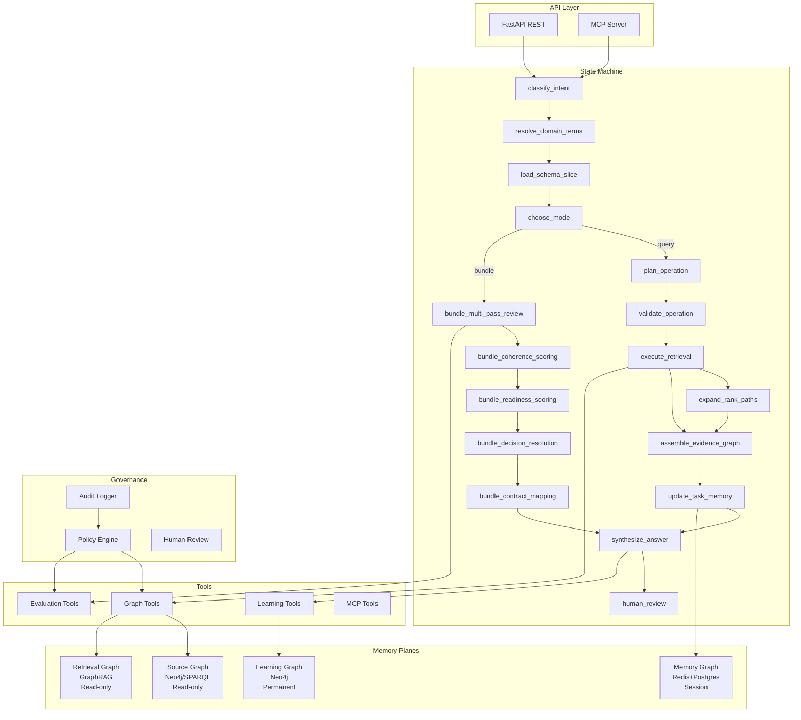

# KGRA — Knowledge Graph Reasoning Agent

**Version 2.0 (Autonomous Learning Edition)**

An autonomous, self-improving hybrid reasoning agent that answers complex queries over graph sources, continuously builds its own knowledge graph, constructs reusable reasoning paths, and evaluates external knowledge bundles.

## Architecture



## Quickstart

```bash
# 1. Install dependencies
pip install -r requirements.txt

# 2. Set environment variables
export KGRA_LLM_API_KEY=sk-...
export KGRA_POSTGRES_PASSWORD=...
export KGRA_NEO4J_PASSWORD=...
export KGRA_REDIS_PASSWORD=...

# 3. Start the API server
uvicorn kgra.src.api.app:app --host 0.0.0.0 --port 8000

# 4. Query the agent
curl -X POST http://localhost:8000/run \
  -H "Content-Type: application/json" \
  -d '{"query": "What is the capital of France?"}'

# 5. Evaluate a knowledge bundle
curl -X POST http://localhost:8000/evaluate_bundle \
  -H "Content-Type: application/json" \
  -d '{"documents": [{"name": "spec.md", "content": "..."}], "bundle_name": "my_bundle"}'
```

## Configuration

Edit `config.yaml` for non-secret settings. All secrets load from environment:

| Variable | Description |
|----------|-------------|
| `KGRA_LLM_API_KEY` | OpenAI/Anthropic API key |
| `KGRA_POSTGRES_PASSWORD` | PostgreSQL password |
| `KGRA_NEO4J_PASSWORD` | Neo4j password |
| `KGRA_REDIS_PASSWORD` | Redis password |
| `KGRA_MCP_SERVER_KEY` | API key for MCP server |

## Testing

```bash
pytest kgra/tests/ -v
```

## Adding a New Tool

1. Create function in `kgra/src/tools/` with async signature
2. Add JSON schema for input/output
3. Register in the appropriate tool category
4. Add governance policy check in `policy_engine.py`
5. Add audit logging
6. Add unit test in `kgra/tests/`

## Adding an MCP Server

1. Add entry to `config.yaml` under `mcp.registry`
2. Set API key as env var
3. Restart KGRA — auto-discovers tools
4. Governance approval required for new servers

## Deployment

```bash
docker build -f kgra/deploy/Dockerfile -t kgra:2.0.0 .
kubectl apply -f kgra/deploy/k8s/
```

## License

Internal — part of MyNewAp1Claude platform.
